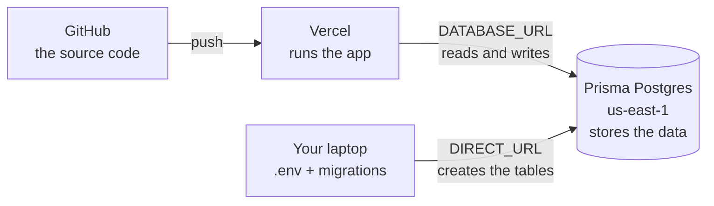

# Deployment overview (historical)

> ⚠️ **Superseded.** For a new deployment use
> **[docs/deployment.md](docs/deployment.md)**.
>
> This file was the working notebook while one specific deployment was being
> debugged — it contains a "status board" tied to that single Vercel project. The
> generic, reusable version of every step here lives in `docs/deployment.md`.

---

## 1. The picture: three places, three jobs



| Place | What lives there | What you do there |
| --- | --- | --- |
| **GitHub** | the source code | push changes |
| **Vercel** | the running app + **its own** environment variables | deploy, set `DATABASE_URL` |
| **Prisma Postgres** | your tasks, categories, settings | create the database, copy the two connection strings |
| **Your laptop** | `.env` (local only) | run migrations, develop, test |

**The single idea that explains every 500 you have seen:** the database is *not*
inside Vercel. Vercel has no disk, so it cannot store your tasks. The app must be
*told* where the database is — and that "where" arrives through environment
variables. If Vercel's `DATABASE_URL` says `localhost`, the app looks for a
database on the Vercel machine, finds none, and the request fails.

```
✅ Vercel  →  DATABASE_URL = pooled.db.prisma.io   →  reaches Prisma Postgres
❌ Vercel  →  DATABASE_URL = localhost:5432        →  nothing there → 500
```

---

## 2. Your status board

✅ done · ⚠️ needs review · ❓ unverified · ❌ to do

| # | Task | Where | Status |
| --- | --- | --- | --- |
| 1 | Prisma Postgres database created (`prisma-postgres-champagne-globe`, `us-east-1`) | Prisma Console | ✅ |
| 2 | Code on GitHub; Vercel project built and deployed | GitHub → Vercel | ✅ |
| 3 | `DATABASE_URL`, `DIRECT_URL`, `NEXT_PUBLIC_APP_URL` added (Production + Preview) | Vercel → Settings → Environment Variables | ⚠️ `DATABASE_URL` is flagged **Needs Attention** |
| 4 | The two database strings point at **different hostnames** (`pooled.` vs plain) | Vercel | ❓ verify — see Step 2 |
| 5 | The migration has been applied **to Prisma Postgres** | your laptop | ❌ the app has no tables yet |
| 6 | Redeployed **after** the env vars changed | Vercel | ❌ |
| 7 | `/api/health` returns `{"ok":true,"database":"ok"}` | browser | ❌ |
| 8 | Auth gate enabled — **the site is public right now** | Vercel + Supabase | ❌ |

---

## 3. Why there are two connection strings

Prisma Postgres gives you **one database behind two hostnames**. They share the
same user and password; only the host differs.

| Env var | Host | Used by | Why |
| --- | --- | --- | --- |
| `DATABASE_URL` | `pooled.db.prisma.io:5432` | the running app | the pooler reuses a small set of connections, so many simultaneous requests do not exhaust the database |
| `DIRECT_URL` | `db.prisma.io:5432` | `prisma migrate` (your laptop) | migrations need session continuity; through a pooler they fail with lock / prepared-statement errors |

Both must end with `?sslmode=require`.

> **The "Quick connect" modal only shows the pooled one** (that is what
> "Connection pooling: On" means). `DIRECT_URL` is not in that box.
>
> The two strings share credentials, so you can build the second from the first:
> take the pooled string and replace `pooled.db.prisma.io` with `db.prisma.io`.
> Same user, same password, same port, same `?sslmode=require`.
>
> In the Prisma Console, **Connect to your database** (not *Quick connect*) is
> where you can generate and copy both.

---

## 4. What to do now, in order

### Step 1 — review the flagged variable

**Where:** Vercel → your project → Settings → Environment Variables → click
`DATABASE_URL`.

**Why:** it carries a **Needs Attention** badge, which means Vercel wants you to
review it. A variable that changed 24h ago is also *not* in effect on a deployment
that was built before the change — env vars are captured at build time.

**Do:**

1. Open `DATABASE_URL` and confirm the value starts with
   `postgres://` and contains `pooled.db.prisma.io` — **not** `localhost`, and
   **without** surrounding quotes.
2. Save it again (even if unchanged). If the badge persists, delete the variable
   and add it afresh.
3. Check the scope is **Production, Preview and Development**. Yours currently
   covers only Production + Preview; previews will work, but local `vercel dev`
   and some tooling will not find it.

### Step 2 — make sure the two strings are different

**Where:** the same list, in Vercel.

**Why:** if you pasted the *same* string into both, migrations will run through
the pooler and fail with confusing lock/prepared-statement errors. This is the
most common mistake here, and it is invisible because `DIRECT_URL` is masked.

**Do:** open `DIRECT_URL` and confirm the host is **`db.prisma.io`**, with **no**
`pooled.` prefix. If it is wrong, replace it.

### Step 3 — create the tables (the app has none yet)

**Where:** your laptop terminal.

**Why:** `prisma migrate deploy` is what creates `Task`, `Category`, `TaskEvent`
and `Settings`. Until it runs, even a perfectly configured app has nothing to
query. Your earlier run said *"No pending migrations"* because `.env` pointed at
**localhost** — it migrated your local database, not Prisma Postgres.

**Do:**

```bash
cd /home/mgkali/Desktop/kairos_web_app

# Paste the two REAL strings. They are long and random; copy-paste them from the
# Prisma Console — never type them. `<your-user>` and `<your-password>` below are
# placeholders: the username is a 64-character hex string and the password starts
# with `sk_`.
export DATABASE_URL='postgres://<your-user>:<your-password>@pooled.db.prisma.io:5432/postgres?sslmode=require'
export DIRECT_URL='postgres://<your-user>:<your-password>@db.prisma.io:5432/postgres?sslmode=require'

bunx prisma migrate deploy
psql "$DIRECT_URL" -c '\dt'      # Task, Category, TaskEvent, Settings
```

> `export` in one command affects only that terminal. That is deliberate: it keeps
> production credentials out of `.env`, so local development stays on localhost.

### Step 4 — redeploy

**Where:** Vercel, or your terminal.

**Why:** environment variables are read when a deployment is built/created. The
deployment currently serving traffic was created with the **old** value, so it
will keep failing until a new one exists.

**Do:** `npx vercel --prod` — or **Deployments → … → Redeploy**. Untick *Use
existing Build Cache* so nothing stale is reused.

### Step 5 — verify

**Where:** browser or terminal.

**Do:**

```bash
curl -s https://kairos-zeta-ivory.vercel.app/api/health
# expected: {"ok":true,"database":"ok"}
```

| Result | Meaning |
| --- | --- |
| `{"ok":true,"database":"ok"}` | ✅ finished — open `/today` and create a task |
| `{"ok":false,"database":"error"}` (503) | still failing — read the logs (below) |
| `Can't reach database server at localhost` | `DATABASE_URL` is still the local value → Step 1 |
| ``table `public.Settings` does not exist`` | env is right, migrations missing → Step 3 |

Then read the real error, which the digest hides:

```bash
npx vercel logs https://kairos-zeta-ivory.vercel.app
```

### Step 6 — decide about authentication

**Where:** Vercel env vars + a free Supabase project.

**Why:** with no Supabase variables set, the sign-in gate is **inert**. Your
deployment is currently **public** — anyone with the URL can read, change and
delete every task. Nothing else on this list protects it.

**Do:** either enable the gate ([`DEPLOYMENT.md`](DEPLOYMENT.md) §10.9 — Supabase
Auth only, your data stays on Prisma Postgres), or set `KAIROS_NO_INDEX=true` as a
stopgap so search engines stay away. `KAIROS_NO_INDEX` hides, it does not secure.

---

## 5. Where each value lives (and why the duplication)

This trips everyone up, so it is worth stating plainly: **`.env` is for your
laptop; Vercel needs its own copies.** There is no automatic link between them.

| Value | Local `.env` | Vercel |
| --- | --- | --- |
| `DATABASE_URL` | `localhost:5432/kairos` | the **pooled** Prisma Postgres URL |
| `DIRECT_URL` | `localhost:5432/kairos` | the **direct** Prisma Postgres URL |
| `NEXT_PUBLIC_APP_URL` | `http://localhost:3000` | `https://kairos-zeta-ivory.vercel.app` |

Files in this repo:

| File | Purpose | Committed? |
| --- | --- | --- |
| `.env` | local development | ❌ ignored |
| `.env.production.local` | template for the Vercel values | ❌ ignored |
| `.env.example` | documentation of every variable | ✅ committed |

**Never upload `.env` to Vercel.** It contains `localhost`, which is exactly the
bug. Uploading it also leaves `NEXT_PUBLIC_APP_URL` pointing at
`http://localhost:3000`, which breaks canonical URLs, Open Graph tags and
`sitemap.xml`.

---

## 6. If something goes wrong

| Symptom / log line | Cause | Fix |
| --- | --- | --- |
| `Can't reach database server at db.prisma.io:5432` (`P1001`) | the connection string still contains a placeholder like `USER`, `PASSWORD` or `…`, so the proxy cannot route it | copy the real string from the Console. This host is reachable — verified with a TCP probe |
| `Can't reach database server at localhost:5432` | `DATABASE_URL` on Vercel is the local value | Step 1 |
| `Environment variable not found: DATABASE_URL.` | the variable is missing in that environment | Step 1 (check the scope) |
| `Authentication failed` / `password authentication failed` | wrong password, or quotes/whitespace pasted in | re-paste, no quotes |
| `prepared statement` / `lock` errors during migration | pooled string used for `prisma migrate` | Step 2 — use the direct host |
| `Too many connections` | app traffic on the direct host | `DATABASE_URL` must be the pooled host |
| ``table `public.Settings` does not exist`` (`P2021`) | migrations were never applied to Prisma Postgres | Step 3 |
| `Application error … Digest: 1234567890` | Next.js hides the message | `npx vercel logs https://kairos-zeta-ivory.vercel.app` |

---

## 7. Things you can safely ignore for now

- **The Prisma 8 upgrade demand.** Only the optional Prisma↔GitHub
  *migration-on-deploy* integration needs it. It is a full data-layer rewrite
  (contract files, a chained query API, a new migration workflow) and the guide
  targets release candidates. Migrations are one command you already run. See
  [`DEPLOYMENT.md`](DEPLOYMENT.md) §12.
- **Docker.** The container setup is for self-hosting. Vercel does not use your
  `Dockerfile` at all.
- **Supabase as a database.** You chose Prisma Postgres for the data. Supabase is
  now only relevant as an optional login provider for Step 6.
- **`.env.production.local` placeholders.** Nothing reads that file
  automatically; it exists so you have the correct shape to copy from.

---

## 8. One-screen summary

```
1. Vercel ▸ Settings ▸ Environment Variables
   • DATABASE_URL  = the FULL pooled string copied from the Prisma Console
   • DIRECT_URL    = the FULL direct string (no "pooled." in the host)
   • NEXT_PUBLIC_APP_URL = https://kairos-zeta-ivory.vercel.app
   (no quotes; placeholders such as USER / PASTE_…_HERE are not values)

2. Laptop:
   export DATABASE_URL='postgres://<your-user>:<your-password>@pooled.db.prisma.io:5432/postgres?sslmode=require'
   export DIRECT_URL='postgres://<your-user>:<your-password>@db.prisma.io:5432/postgres?sslmode=require'
   bunx prisma migrate deploy

3. npx vercel --prod

4. curl -s https://kairos-zeta-ivory.vercel.app/api/health
   → {"ok":true,"database":"ok"}

5. Enable the auth gate, or the site is public.
```
