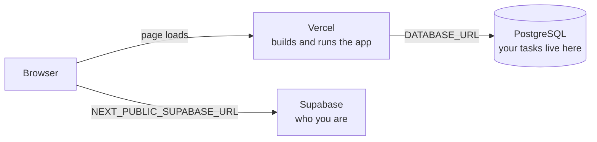

# Deploying Kairos — start here

Everything you need to put Kairos on the internet and let people sign up. This
page is the path; the other pages are the detail.

**You will end up with:** a Next.js app running on Vercel, its data in a
PostgreSQL database, and sign-in through Supabase — where every account gets its
own private workspace.

**Time:** about 30 minutes. **Cost:** free tiers on all three services.

---

## The mental model

You are wiring up three services that know nothing about each other. Almost every
deployment problem is really *"these three were not pointed at each other"* — so
it is worth thirty seconds to hold this picture in your head.

| Piece | Responsible for | Never does |
| --- | --- | --- |
| **Vercel** | building the code and serving it. **No disk**, so it cannot store your data | hold your tasks |
| **PostgreSQL** | the only place your tasks live | know who you are |
| **Supabase** | sign-in: who you are, nothing else | see your tasks |
| **Your computer** | creating the tables, and running the app locally | — |

Two ideas do most of the work:

- **The app learns where everything is from environment variables.** Point one at
  the wrong place and pages fail, usually with an error that does not mention the
  variable at all.
- **Sign-in and data are separate.** Supabase proves who you are; the app then
  remembers that and keeps each person's rows apart. Nobody logs into your
  database through Supabase.

---

## The path

Work top to bottom. Each part ends with something you can check — if the check
fails, fix it there rather than carrying the problem forward, because a
misconfigured part makes *later* steps fail in confusing ways.

| # | Step | Part |
| --- | --- | --- |
| 1 | Create the PostgreSQL database | **[Part 1 §3](deployment.md#3-create-the-database)** |
| 2 | Push the code to GitHub | [Part 1 §4](deployment.md#4-put-the-code-on-github) |
| 3 | Create the Vercel project | [Part 1 §5](deployment.md#5-create-the-vercel-project) |
| 4 | Set the database environment variables | [Part 1 §6](deployment.md#6-set-the-environment-variables) |
| 5 | Create the tables (migrations) | [Part 1 §7](deployment.md#7-create-the-tables-migrations) |
| 6 | Deploy and hit `/api/health` | [Part 1 §8](deployment.md#8-deploy-and-verify) |
| 7 | Create the Supabase project | **[Part 2 §2](auth-setup.md#2-create-the-supabase-project)** |
| 8 | **Validate the project URL** | [Part 2 §3](auth-setup.md#3-validate-the-project-url-do-not-skip-this) |
| 9 | Turn sign-ups on + decide on email confirmation | [Part 2 §4](auth-setup.md#4-turn-sign-ups-on) · [§5](auth-setup.md#5-the-email-decision-read-this) |
| 10 | Enable Google (Supabase **and** Google Cloud) | [Part 2 §6](auth-setup.md#6-enable-google) |
| 11 | Set Site URL and redirect URLs | [Part 2 §7](auth-setup.md#7-site-url-and-redirects) |
| 12 | Add the two `NEXT_PUBLIC_*` variables to Vercel | [Part 2 §9](auth-setup.md#9-where-to-put-them-in-vercel) |
| 13 | **Redeploy**, then run the verification checklist | [Part 2 §10](auth-setup.md#10-deploy) · [§11](auth-setup.md#11-verify) |

- **Part 1 — [Database and hosting](deployment.md)**: Prisma Postgres + Vercel
- **Part 2 — [Letting people sign in](auth-setup.md)**: Supabase Auth, email and Google
- **When something breaks — [Troubleshooting](troubleshooting.md)**

---

## Before you start

- A **GitHub** account with this repository pushed to it
- A **Vercel** account (free *Hobby* plan is enough)
- A **Supabase** account (free tier covers 50,000 monthly active users)
- A **PostgreSQL** database — [Prisma Postgres](https://console.prisma.io) is what
  this guide uses, but any Postgres works
- Locally: **Node.js 22+** and **[Bun](https://bun.sh)**

---

## Five rules that prevent almost every failure

Everything below is learned from failures, not theory. Reading these five now
saves an evening later.

**1. The URL and the key must come from the same Supabase project.**
They are a pair. A key from project A with a URL from project B looks completely
normal and fails on the first request. [Check it in ten seconds](auth-setup.md#3-validate-the-project-url-do-not-skip-this).

**2. `NEXT_PUBLIC_*` values are baked in when the app is built.**
Changing one and refreshing the page does nothing. You must **deploy again**.
This is the single most common "I fixed it but it's still broken".

**3. There are two database URLs and they are not interchangeable.**
The *pooled* host serves the running app; the *direct* host runs migrations.
Swapping them gives you either lock errors or connection exhaustion.

**4. Environment variables are per-environment.**
A variable set only for **Production** breaks every preview deployment. Tick all
three: Production, Preview, Development.

**5. `KAIROS_ALLOWED_EMAILS` must stay unset on a public app.**
It is an allow-list for a *private* deployment. Leave it set and every new user
is signed straight back out to `/login?error=not_allowed`.

---

## Where things live

| Document | What it is |
| --- | --- |
| **[deployment.md](deployment.md)** | Part 1 — database, Vercel, migrations, operations |
| **[auth-setup.md](auth-setup.md)** | Part 2 — Supabase Auth for a public app |
| **[troubleshooting.md](troubleshooting.md)** | The failures that cost the most time, and how to diagnose them fast |
| **[project-context.md](project-context.md)** | The state of the project: architecture, data model, decisions, failure log, open items |
| [multi-user.md](multi-user.md) | Why the app is built the way it is (design rationale) |
| [supabase-auth.md](supabase-auth.md) | ⚠️ Legacy — the old private single-user model. Not for a public app |

Root-level `DEPLOYMENT.md`, `DEPLOY_OVERVIEW.md` and `VERCEL_ENV_SETUP.md` are
earlier drafts, kept for background. **This folder is the current guide.**
