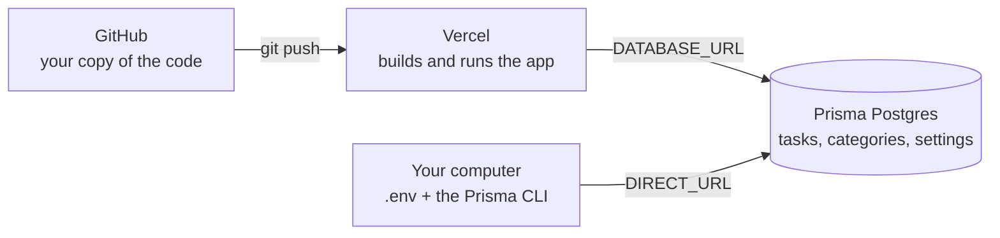

# Part 1 — Database and hosting

Prisma Postgres + Vercel. This is the first half of
**[the deployment guide](README.md)**; Part 2 adds sign-in
([auth-setup.md](auth-setup.md)).

> **Target setup:** [Vercel](https://vercel.com) runs the app, [Prisma
> Postgres](https://prisma.io/postgres) stores the data.
> **Time:** about 20 minutes. **Cost:** free tiers on both.
>
> **Done when** `/api/health` answers `{"ok":true,"database":"ok"}`. Until then,
> ignore anything about sign-in — fix this half first, because a wrong database
> URL makes later steps fail in ways that look unrelated.

---

## Contents

1. [How the pieces fit together](#1-how-the-pieces-fit-together)
2. [Before you start](#2-before-you-start)
3. [Create the database](#3-create-the-database)
4. [Put the code on GitHub](#4-put-the-code-on-github)
5. [Create the Vercel project](#5-create-the-vercel-project)
6. [Set the environment variables](#6-set-the-environment-variables)
7. [Create the tables (migrations)](#7-create-the-tables-migrations)
8. [Deploy and verify](#8-deploy-and-verify)
9. [Let people sign in](#9-let-people-sign-in)
10. [Reference: environment variables](#10-reference-environment-variables)
11. [Reference: everyday operations](#11-reference-everyday-operations)
12. [Troubleshooting](#12-troubleshooting)
13. [Alternatives](#13-alternatives)

---

## 1. How the pieces fit together

Kairos is a multi-user web app: each account gets its own private workspace in the
same PostgreSQL database. Deploying it involves **three separate things** — and
nearly every deployment problem is really "these three were not pointed at each
other".



| Where | Responsible for |
| --- | --- |
| **GitHub** | the source code; Vercel watches it and rebuilds on every push |
| **Vercel** | building the code and serving the site. It has **no disk**, so it cannot store your data |
| **Prisma Postgres** | the database. The only place your tasks live |
| **Your computer** | running migrations (which create the tables), and local development |

**The one idea to remember:** the app learns where the database is from an
environment variable. Point that at the wrong place and every page fails — which
is what a bare `Application error … Digest: 1234567890` usually means.

---

## 2. Before you start

You need:

- A **GitHub** account, with this repository pushed to it
- A **Vercel** account — the free *Hobby* plan is enough
- A **Prisma Postgres** account — the free tier is enough
- Locally: **Node.js 22+** and **[Bun](https://bun.sh)**

---

## 3. Create the database

### 3.1 Create it

1. Open <https://console.prisma.io> and create a new database.
2. Choose the region **closest to your Vercel region** (for example `us-east-1`
   for both) so queries do not cross the planet.

### 3.2 Copy both connection strings

Open the database → **Connect to your database** → **Generate new connection
string**, and copy **both** values:

| Purpose | Hostname looks like | Becomes |
| --- | --- | --- |
| Application traffic | `pooled.db.prisma.io` | `DATABASE_URL` |
| Migrations and admin tools | `db.prisma.io` | `DIRECT_URL` |

Both end with `?sslmode=require`. They share the same username and password — the
hostname is the only difference.

> **Why two?** The *pooled* host runs a connection pooler, which lets many
> simultaneous serverless requests share a small number of database connections.
> Migrations need a stable session, which a pooler cannot provide, so they use the
> *direct* host.
>
> **Never swap them.** Migrations through the pooler fail with lock and
> prepared-statement errors; application traffic through the direct host works
> quietly until it exhausts the much smaller direct connection limit.

> ⚠️ **Copy the real values, not the examples.** Real strings contain a
> **64-character random username** and a password starting with `sk_`:
>
> ```
> postgres://caad5c07…64 hex chars…:sk_fsx6…@pooled.db.prisma.io:5432/postgres?sslmode=require
> ```
>
> Angle brackets (`<your-user>`) and words like `USER`, `PASSWORD` or `PASTE_…_HERE`
> are placeholders. A URL that still contains one fails with
> `P1001 Can't reach database server`, which *looks* like a network problem but is
> not.

---

## 4. Put the code on GitHub

```bash
git remote add origin git@github.com:<you>/kairos.git
git push -u origin main
```

Confirm `.env` is **not** in the repository — it is for your computer only
(`.gitignore` already excludes it).

---

## 5. Create the Vercel project

1. <https://vercel.com/new> → **Import** your `kairos` repository.
2. Framework preset: **Next.js** (detected automatically).
3. **Leave the build settings alone.** `package.json` already runs
   `prisma generate` on install, and the build command is
   `prisma generate && next build`.
4. Deploy. The first build will succeed but the site will not work yet — there is
   no database connection. That is the next step.

---

## 6. Set the environment variables

**Vercel → your project → Settings → Environment Variables.**

| Variable | Value |
| --- | --- |
| `DATABASE_URL` | the **pooled** connection string |
| `DIRECT_URL` | the **direct** connection string |
| `NEXT_PUBLIC_APP_URL` | `https://<your-project>.vercel.app` |

Three rules that matter:

1. **No quotes.** In a `.env` file you write `DATABASE_URL="postgres://…"`. In the
   Vercel form the field is the literal value — quotes become part of the URL and
   break the connection.
2. **No stray whitespace.** A trailing space or newline is invisible in the form
   and fatal to the connection.
3. **Tick Production, Preview *and* Development.** A Production-only value breaks
   preview deployments, which is confusing to debug later.

### Doing this from the command line

The CLI is quicker than the dashboard, and it keeps values out of your shell
history — but it has one trap worth knowing before you use it.

If a value *looks like a credential*, the CLI stops at an interactive prompt
asking how to store it. If stdin closes at that point the variable is **silently
not saved** — and if you removed the old one with `env rm` first, it is now gone
entirely. That failure is easy to miss, because the command appears to succeed.

Use the non-interactive form and set all three environments in one call:

```bash
npx vercel env add DATABASE_URL production,preview,development \
  --value "postgres://…pooled…" --no-sensitive --force --yes

npx vercel env add DIRECT_URL production,preview,development \
  --value "postgres://…direct…" --no-sensitive --force --yes

npx vercel env add NEXT_PUBLIC_APP_URL production,preview,development \
  --value "https://<your-project>.vercel.app" --no-sensitive --force --yes
```

`--no-sensitive` stores the value as **Config** so it stays readable later.

Then read back what actually landed, rather than trusting the command's output:

```bash
npx vercel env pull /tmp/check.env --environment=production --yes
grep -E "DATABASE_URL|DIRECT_URL|NEXT_PUBLIC_APP_URL" /tmp/check.env
```

Either way, **environment variables are captured when a deployment is built.**
Changing them does nothing until you deploy again. See
[troubleshooting.md §5](troubleshooting.md#5-setting-variables-from-the-vercel-cli).

---

## 7. Create the tables (migrations)

Vercel never runs migrations. The database is empty at this point; this step
creates the tables.

On your computer, in the project directory:

```bash
# Paste the two real strings from step 3.2.
export DATABASE_URL='postgres://…pooled…'
export DIRECT_URL='postgres://…direct…'

# Convenience: derive DIRECT_URL from DATABASE_URL so the host is always right.
# export DIRECT_URL=$(printf '%s' "$DATABASE_URL" | sed 's/pooled\.db\.prisma\.io/db.prisma.io/')

bunx prisma migrate deploy
```

Expect:

```
All migrations have been successfully applied.
```

Confirm the tables exist:

```bash
psql "$DIRECT_URL" -c '\dt'
# Task   Category   TaskEvent   Settings   _prisma_migrations
```

> `export` only affects that one terminal window. That is intentional — it keeps
> production credentials out of your local `.env`, so `bun run dev` keeps talking
> to your local database.

---

## 8. Deploy and verify

```bash
npx vercel --prod
```

Then check the health endpoint, which performs a real query:

```bash
curl -s https://<your-project>.vercel.app/api/health
# {"ok":true,"database":"ok"}
```

Finally, open the site and create a task. Reload the page — it should still be
there.

### Reading errors

Next.js hides server-side exceptions behind
`Application error: a server-side exception has occurred` plus a **digest** (a
correlation id, not a message). The real text is in the runtime logs:

```bash
npx vercel logs https://<your-project>.vercel.app
```

---

## 9. Let people sign in

Kairos is multi-user: every account gets its own private workspace, and the
separation is enforced in the query layer. The sign-in gate is **on by default
and fails closed**, so a deployment missing these variables returns an error
rather than serving one shared workspace to everybody.

Setup takes about five minutes and lives in its own guide:

**→ [Letting people sign up (Supabase Auth)](auth-setup.md)**

---

## 10. Reference: environment variables

| Variable | Required | Purpose |
| --- | --- | --- |
| `DATABASE_URL` | ✅ | pooled connection used by the running app |
| `DIRECT_URL` | for migrations | direct connection used by the Prisma CLI only |
| `NEXT_PUBLIC_APP_URL` | recommended | absolute origin for canonical links, `sitemap.xml`, social metadata |
| `NEXT_PUBLIC_SUPABASE_URL` | ✅ | Supabase project URL; the gate needs it |
| `NEXT_PUBLIC_SUPABASE_ANON_KEY` | ✅ | with the above, enables the gate |
| `KAIROS_ALLOWED_EMAILS` | **no** — leave it unset | an allow-list for a *private* deployment. Setting it on a public app signs every other account out |
| `KAIROS_AUTH_DISABLED` | no | `true` removes the gate and puts every visitor in one shared `local` workspace — local development only |
| `KAIROS_NO_INDEX` | no | `true` serves `Disallow: /` to crawlers |
| `PORT` | no | local/Docker only; Vercel manages this |

`NEXT_PUBLIC_*` values are **inlined into the browser bundle at build time**, so
changing them always requires a new deployment. Forgetting this is the usual
reason "I set the variable but nothing changed". Under `compose.yaml` that means
`docker compose up -d --build` — Compose passes them as **build arguments** from
`.env`, while a plain `docker compose up` reuses the image built with the old
values.

`DATABASE_URL` and `DIRECT_URL` are read at runtime, but a redeploy is still the
simplest way to be sure.

---

## 11. Reference: everyday operations

### Changing the schema

```bash
# 1. edit prisma/schema.prisma, then create the migration locally
bun run db:migrate

# 2. commit the new prisma/migrations/<timestamp>_<name>/ folder

# 3. apply it to production before or after deploying
export DATABASE_URL='…pooled…' DIRECT_URL='…direct…'
bunx prisma migrate deploy
```

Vercel does not run migrations for you. If you want that automated, a small
GitHub Action that runs `bunx prisma migrate deploy` on `main` is the usual
approach. (Do **not** put it in the Vercel build command: preview deployments
would then race the production database.)

### Backups

- **In the app:** Settings → Backup & data → *Export JSON*. This is a complete,
  portable snapshot and the easiest option.
- **At the database level:**
  ```bash
  pg_dump "$DIRECT_URL" > "kairos-$(date +%F).sql"
  ```

Both are private data. Never commit them (`*.kairos.json` and `backups/` are
already ignored).

### Logs

```bash
npx vercel logs https://<your-project>.vercel.app
```

Or: project → Deployments → the deployment → **Runtime Logs**. For an untruncated
stack trace, use **Functions → Logs**.

### Local development

Local development uses the same code but its own database:

```bash
docker compose up -d db      # a throw-away PostgreSQL (see compose.yaml)
bun install
bunx prisma migrate deploy   # creates the tables locally
bun run dev
```

No Docker? See [Docker & self-hosting](#13-alternatives) below.

Two traps worth knowing now, because both waste a lot of time later:

- **`bun run dev` and `next start` read different files.** Dev loads `.env`; a
  local production run (`bun run build && bun start`) *also* loads
  `.env.production.local`, so it talks to the **remote** database. `/api/health`
  can then answer `503 {"ok":false,"database":"error"}` — expected, not a bug.
  Use `bun run dev` for local work.
- **A real environment variable beats a `.env` file.** If you ever ran
  `export DATABASE_URL=…` in a shell, that value wins over `.env.local` for as
  long as the shell lives. The file on disk looks perfectly correct while the app
  ignores it. Test config-dependent behaviour in a clean environment:

  ```bash
  env -u DATABASE_URL -u DIRECT_URL bun run dev
  ```

### Checks before you push

```bash
bun run typecheck   # tsc
bun run lint        # eslint
bun run test        # unit tests (Vitest)
```

---

## 12. Troubleshooting

Find the real error first:

```bash
npx vercel logs https://<your-project>.vercel.app
```

| Log message | Cause | Fix |
| --- | --- | --- |
| `Can't reach database server at localhost:5432` | `DATABASE_URL` is still your local development value | step 6 — set the pooled string |
| `Can't reach database server` at `db.prisma.io` (`P1001`) | the URL still contains a placeholder (`USER`, `PASSWORD`, `…`) | step 3.2 — copy the real string |
| `Environment variable not found: DATABASE_URL` | missing in that environment | step 6 — check the environment scope |
| `Authentication failed` / `password authentication failed` | wrong password, or quotes/whitespace pasted into the form | re-paste without quotes |
| ``The table `public.Settings` does not exist`` (`P2021`) | migrations were never applied to this database | step 7 |
| `prepared statement` or lock errors during a migration | the pooled string was used for `prisma migrate` | use the **direct** host for `DIRECT_URL` |
| `Too many connections` | app traffic is on the direct host | `DATABASE_URL` must be the **pooled** host |
| `Application error … Digest: 1234567890` | Next.js is hiding the message | read the runtime logs |
| pages still show old behaviour after changing a variable | environment variables are captured at build time | redeploy — see [troubleshooting.md §3](troubleshooting.md#3-i-changed-a-variable-and-nothing-happened) |
| every route shows *"Kairos is misconfigured: authentication is enabled but Supabase is not set up"* | the sign-in variables are missing, and the gate fails closed on purpose | Part 2 — [`auth-setup.md`](auth-setup.md) §9 |
| sign-in shows a bare **Failed to fetch** | the browser could not reach Supabase at all | [`troubleshooting.md` §1](troubleshooting.md#1-failed-to-fetch-on-the-sign-in-page) |

When the log is empty, the request never reached your server — that is a browser
problem, not a database one. Start at
[troubleshooting.md](troubleshooting.md).

---

## 13. Alternatives

### Docker / self-hosting

`Dockerfile` and `compose.yaml` run Kairos as a container with PostgreSQL beside
it, for a home server, a VPS, or Oracle Cloud's free tier. The database is
external to the image (`compose.yaml` starts a `db` service); `/data` is no longer
used. Keep the published port on `127.0.0.1` and reach it over a VPN or an SSH
tunnel unless the sign-in gate is enabled.

```bash
cp .env.example .env        # NEXT_PUBLIC_SUPABASE_URL + _ANON_KEY, or KAIROS_AUTH_DISABLED=true
docker compose up -d --build

docker compose ps                       # kairos should reach "healthy"
curl -s localhost:3000/api/health       # {"ok":true,"database":"ok"}
docker compose logs kairos              # migration output + the config warning, if any
```

The two `NEXT_PUBLIC_SUPABASE_*` values are **build arguments**: `next build`
inlines them and compiles the CSP `connect-src` from the Supabase origin, so
Compose forwards them from `.env` at build time and repeats them at runtime.
Changing them therefore needs `--build`. A build that had none produces a
failing-closed app — 500 on every route but `/`, the health probe included, which
is why such a container reports `unhealthy` while its landing page still renders.
`KAIROS_AUTH_DISABLED=true` is the escape hatch for a single-user box, and it is
the only setting that makes such a build usable.

### Other databases

The Prisma datasource is plain PostgreSQL, so any Postgres works — the difference
is only the connection strings and who manages the pooler. Supabase, Neon and
plain self-managed Postgres are all viable; [`DEPLOYMENT.md`](../DEPLOYMENT.md)
keeps the Supabase-specific runbook.

### Do not upgrade to Prisma ORM 8 yet

Prisma's optional GitHub *migration-on-deploy* integration asks for Prisma ORM 8.
The application does not need it: ORM 8 replaces the query API, the schema format
and the migration workflow, and would mean rewriting the whole data layer. It is
not required for anything in this guide — migrations are one command (step 7).
