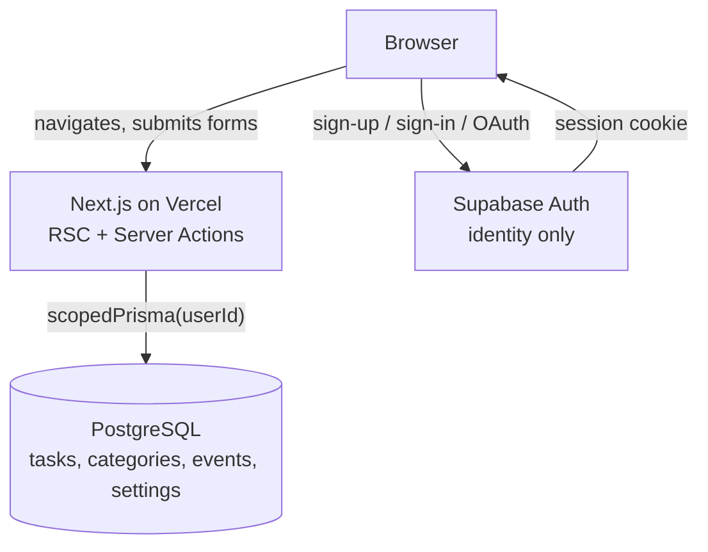
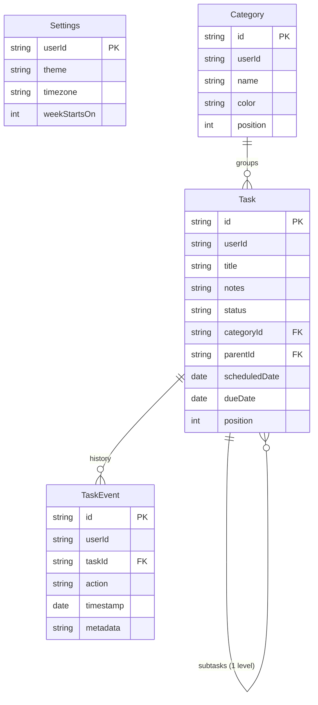

# Kairos — project context

Everything about this project as of **2026-10-08**: what it is, how it is built,
where it runs, what has been decided, what has broken, and what is left.

This is the **state of the project** document. For *how to deploy it*, read
[README.md](README.md) instead — that is the guide; this is the reference.

---

## Contents

1. [What Kairos is](#1-what-kairos-is)
2. [Status at a glance](#2-status-at-a-glance)
3. [Architecture](#3-architecture)
4. [Data model](#4-data-model)
5. [Multi-tenancy: how isolation works](#5-multi-tenancy-how-isolation-works)
6. [Authentication and the gate](#6-authentication-and-the-gate)
7. [Route areas and access](#7-route-areas-and-access)
8. [Code map](#8-code-map)
9. [Environment variables](#9-environment-variables)
10. [Local development](#10-local-development)
11. [Testing](#11-testing)
12. [Live infrastructure](#12-live-infrastructure)
13. [Timeline of decisions](#13-timeline-of-decisions)
14. [Failure log and lessons](#14-failure-log-and-lessons)
15. [Limitations and not-yet-built](#15-limitations-and-not-yet-built)
16. [Open items](#16-open-items)
17. [Command reference](#17-command-reference)

---

## 1. What Kairos is

An open-source, self-hosted task manager. It organises work by **category and
date**, breaks tasks into **one level of subtasks**, and shows where progress
comes from with a statistics page.

The name is the Greek *καιρός* — the right, opportune moment to act.

**Product shape today:** a multi-user web app. Anyone can register with email or
Google, and each account gets a **private workspace**. There is no sharing, no
teams and no collaboration — accounts are individual by design.

| | |
| --- | --- |
| License | MIT |
| Audience | anyone who wants a focused task list without an account on someone else's service |
| Model | free to use; each user's data is theirs alone |

---

## 2. Status at a glance

| Area | State |
| --- | --- |
| **Application** | feature-complete for the described scope, deployed and reachable |
| **Multi-user isolation** | implemented and tested (10 integration tests) |
| **Auth** | Supabase — email/password **and** Google, both enabled and working |
| **Database** | PostgreSQL (Prisma Postgres) — migrated, in sync with the schema |
| **Production** | builds and serves; gate verified on the live URL |
| **Unit tests** | 81 passing |
| **Integration tests** | 10 passing |
| **Typecheck / lint** | clean |
| **Account deletion** | ❌ not built — see [§15](#15-limitations-and-not-yet-built) |
| **Rate limiting** | ❌ not built |
| **Privacy policy / terms** | ❌ not written |

**Working tree:** documentation and one config change are uncommitted; there is
one **dead file** to remove (see [§16](#16-open-items)).

---

## 3. Architecture

### Stack

| Concern | Choice | Installed |
| --- | --- | --- |
| Framework | Next.js App Router, React Server Components | `next` 15.5.27 |
| UI runtime | React | 19.3.0 |
| Language | TypeScript | 5.9.3 |
| Styling | Tailwind + shadcn/ui, Lucide icons, Poppins | `tailwindcss` 3.4.19 |
| ORM | Prisma | `prisma` / `@prisma/client` 6.19.3 |
| Database | PostgreSQL | Prisma Postgres (managed) |
| Auth | Supabase Auth via `@supabase/ssr` | 0.12.7 |
| Mutations | Server Actions + Zod validation + optimistic UI | `zod` 3.24 |
| Drag and drop | dnd-kit (pointer **and** keyboard sensors) | `@dnd-kit/core` 6.3.1 |
| Charts | Recharts | 2.15 |
| Dates | date-fns | 4.1 |
| Unit tests | Vitest | 2.1.9 |
| E2E tests | Playwright | 1.49.1 |
| Package manager | **Bun** (not npm) | 1.3.x |

### Runtime shape

The browser talks to **two** backends, and it is worth being precise about which
does what:



- **Task data never touches Supabase.** All reads and writes go through Server
  Components and Server Actions on the Next.js server.
- **Supabase only establishes identity.** The browser talks to it directly for
  sign-in (which is why `NEXT_PUBLIC_SUPABASE_URL` must be reachable from the
  browser and allowed in the CSP).
- **There is no separate backend**, no React Router and no TanStack Query — the
  app is deliberately Server-Component-first, with Client Components only for
  interaction (drag and drop, dialogs, optimistic updates).

### Where it runs

| Layer | Service | Identifier |
| --- | --- | --- |
| Hosting | Vercel | project `kairos`, team `mahmoud-aths-projects` |
| Production URL | Vercel | `https://kairos-zeta-ivory.vercel.app` |
| Database | Prisma Postgres | pooled host for the app, direct host for migrations |
| Auth | Supabase | project ref `jexeakhohftqqwfjeqkd` |

---

## 4. Data model

Four tables, all owned by a user. Defined in `prisma/schema.prisma`.



Design points worth knowing:

- **`status` is a string** (`TODO` | `DONE`), validated at the application
  boundary in `src/lib/validation.ts`, not by a database enum.
- **Date-only values** (`scheduledDate`, `dueDate`) are stored as **UTC
  midnight** so they are timezone independent. Event timestamps are real UTC
  instants.
- **Subtasks are one level deep**, enforced in `src/lib/task-rules.ts`. A
  subtask always shares its parent's owner and cannot be reparented across
  users.
- **`Category.name` is unique per user**, not globally — two people may both
  have a category called "Work".
- **`Settings` is keyed by `userId`** (it was a fixed single row before
  multi-user).
- **Every index leads with `userId`**, because every query filters on it.
- `TaskEvent` records history: `created`, `completed`, `reopened`, `deleted`,
  `moved`, `updated`.
- Labels and priorities were **removed from the product**; a task is grouped by
  its category and dates.

### Migrations

```
prisma/migrations/
  20261006120000_init                   ← squashed Postgres schema
  20261008120000_multi_user_scoping     ← adds userId to every table
```

The `init` migration is a **squashed** one: the original SQLite migrations were
replaced with a single Postgres init when the database changed. The multi-user
migration **drops and recreates** all four tables — destructive by design,
approved pre-launch when there was no data to preserve.

---

## 5. Multi-tenancy: how isolation works

This is the most important design decision in the codebase.

**Isolation is enforced in the query layer, not the UI.** Every service function
receives a `userId` and builds its client from `scopedPrisma(userId)`:

```ts
// src/server/db.ts
export function scopedPrisma(userId: string) { … }
```

`scopedPrisma` is a Prisma `$extends` query hook over
`TENANT_MODELS = { Task, Category, TaskEvent, Settings }` that injects `userId`:

- into **`where`** for reads, updates and deletes
- into **`data`** for `create`, `createMany` and `upsert`

Three properties make this trustworthy:

1. **It fails closed.** An empty `userId` throws rather than returning an
   unscoped query.
2. **The tenant can only come from the session.** `requireUserId()` in
   `src/server/auth.ts` is the single place a user id is established, and it
   always reads the verified Supabase session — never a request body, query
   string or form field. Callers cannot supply their own id.
3. **Creates still name `userId` explicitly.** The scoped client is cast to
   `PrismaClient` to preserve normal result typing, so `data` is not rewritten
   in a way TypeScript hides. This is deliberate: ownership is auditable at every
   write site.

**Service convention:** every function takes `userId` first and then does
`const prisma = scopedPrisma(userId);`. Query bodies stay unchanged, and helpers
that participate in a transaction take a `ScopedTx`.

**Known limitation (documented, accepted):** the extension hooks apply to
top-level operations only, so relations loaded via `include` (subtasks) are not
independently filtered. This is safe because a subtask always shares its parent's
owner and cannot be reparented across users.

**Proof:** `tests/integration/isolation.test.ts` exercises this against a real
PostgreSQL with random tenant ids — 10 tests covering reads, writes, updates,
deletes, aggregates and settings.

---

## 6. Authentication and the gate

### The gate is on by default and fails closed

```ts
// src/server/auth.ts
export function isAuthDisabled(): boolean {
  return process.env.KAIROS_AUTH_DISABLED === "true";
}
```

This was originally **fail-open** — it disabled itself whenever Supabase was not
configured, which is reasonable for a private single-user app and dangerous for a
public multi-user one. It was inverted. Now:

| Situation | Behaviour |
| --- | --- |
| Configured | real gate: session required, `/login` for signed-out visitors |
| Not configured, not explicitly disabled | **refuses to serve** with an actionable error on every route, `/api/health` included |
| `KAIROS_AUTH_DISABLED=true` | gate off; everyone shares one `local` workspace |

### Flow

- **`/register`** and **`/login`** are separate pages sharing one component
  (`src/components/auth/auth-form.tsx`, with a `mode` prop). Google appears on
  both — Supabase treats the first use as sign-up and later uses as sign-in.
- **`/auth/callback`** is a Route Handler (not a Server Component) because it
  must set cookies when exchanging the OAuth or email `code` for a session.
- **`src/middleware.ts`** refreshes the session and redirects:
  - `PUBLIC_PATHS = ["/api/health", "/auth/callback"]`
  - `AUTH_PATHS = ["/login", "/register"]` — signed-in users are sent to `/today`
  - signed-out visitors go to `/login?next=…`, guarded by `safeNextPath()` in
    `src/lib/auth-rules.ts` against open redirects
- `KAIROS_ALLOWED_EMAILS` is an **allow-list for a private deployment**. On a
  public app it must stay unset, or every other account is signed straight back
  out.

---

## 7. Route areas and access

The app is one application with **three route groups**. A parenthesised group is
organisational only — it contributes no URL segment — so every existing URL is
unchanged.

| Area | Directory | Layout provides | Owns |
| --- | --- | --- | --- |
| Marketing | `src/app/(marketing)/` | public navbar + footer | `/` |
| Authentication | `src/app/(auth)/` | full-screen centring frame | `/login`, `/register` |
| Application | `src/app/(app)/` | sidebar + workspace shell (`AppShell`) | `/today`, `/tasks`, … |

`src/app/layout.tsx` stays minimal: `<html>`/`<body>`, fonts, global CSS and the
site-wide metadata. It performs **no** session lookup and **no** query, which is
what lets the landing page be statically rendered.

### Routes

| Route | Area | Access |
| --- | --- | --- |
| `/` | marketing | **public**, statically rendered — no session and no Supabase configuration required |
| `/login` | auth | public, `noindex` |
| `/register` | auth | public, indexable, listed in `sitemap.xml` |
| `/today`, `/tasks`, `/completed`, `/categories/[id]`, `/statistics`, `/settings` | app | **session required**, `noindex` |
| `/auth/callback` | root | public — it sets the session cookie and must never be redirected |
| `/api/health` | root | public — uptime checks run before a session exists |
| `/api/backup` | root | session required |
| `robots.txt`, `sitemap.xml`, `icon.svg` | root | static |

### The access matrix

Classification lives in `src/lib/auth-rules.ts` as pure functions
(`isPublicPath`, `isAuthPath`), so the middleware and the unit tests apply exactly
the same rules and the matrix is testable without standing up Supabase.

| Request | Result |
| --- | --- |
| `/` | served, always — signed in or out, configured or not |
| signed out → protected route | `307` → `/login?next=<path>` |
| signed out → unknown path | `307` → `/login?next=…` — **fails closed**, not open |
| signed in → `/login` or `/register` | `307` → `/today` |
| signed in, email not allowed | session dropped → `/login?error=not_allowed` |
| auth enabled but Supabase unconfigured | `500` config error on everything **except** `/` |
| `KAIROS_AUTH_DISABLED=true` | no gate at all (local development, Playwright) |

Every entry is matched **exactly**, never by prefix: `/api/healthy-looking` does
not inherit `/api/health`'s exemption, and `/registering` is not an auth page. A
trailing slash is ignored, because Next redirects it anyway.

---

## 8. Code map

```
src/
  app/
    (marketing)/      public landing page + navbar/footer layout
    (auth)/           login, register + centring layout
    (app)/            authenticated shell: today, tasks, completed, categories,
                      statistics, settings + error/loading boundaries
    api/              health, backup
    auth/callback/    OAuth + email code exchange
  components/
    auth/             auth-form, auth-shell
    marketing/        brand, nav, site-header, site-footer, hero, app-preview,
                      features, how-it-works, faq, final-cta
    tasks/            workspace, rows, sections, toolbar, quick-add, optimistic
    categories/ dnd/ layout/ settings/ statistics/ taxonomy/ ui/
  lib/
    auth-rules.ts     allowedEmails, isEmailAllowed, safeNextPath
    task-rules.ts     subtask rules
    validation.ts     Zod schemas
    dates.ts filters.ts ordering.ts stats.ts views.ts constants.ts site.ts
  server/
    auth.ts           the gate; requireUserId()
    db.ts             prisma + scopedPrisma(userId)
    serializers.ts    DB rows -> client types
    actions/          Server Actions (tasks, taxonomy, settings, backup, auth, examples)
    services/         all data access: tasks, taxonomy, settings, events,
                      statistics, backup, examples
  middleware.ts       session refresh + access gate
  types/kairos.ts     shared types
tests/
  unit/               8 files, 81 tests
  integration/        isolation.test.ts, 10 tests + setup guard
  e2e/                Playwright: task workflow, drag and drop, backup
```

**105 source files**, 6 Server Action modules, 7 services, 2 API routes.

---

## 9. Environment variables

| Variable | Required | Purpose |
| --- | --- | --- |
| `DATABASE_URL` | ✅ | PostgreSQL connection the app uses. **Pooled** host in production |
| `DIRECT_URL` | ✅ for migrations | direct connection, used by the Prisma CLI only |
| `NEXT_PUBLIC_SUPABASE_URL` | ✅ | Supabase project URL; the gate needs it |
| `NEXT_PUBLIC_SUPABASE_ANON_KEY` | ✅ | public anon / publishable key |
| `NEXT_PUBLIC_APP_URL` | recommended | absolute origin for canonical links, sitemap, social metadata |
| `KAIROS_ALLOWED_EMAILS` | ❌ leave unset | allow-list for a *private* deployment |
| `KAIROS_AUTH_DISABLED` | no | `true` removes the gate — **local development only** |
| `KAIROS_NO_INDEX` | no | `true` serves `Disallow: /` to crawlers |
| `PORT` | no | local/Docker only; Vercel manages it |

**Two rules that cause most problems:**

1. **`NEXT_PUBLIC_*` is inlined at build time.** Changing one requires a new
   build, not a restart. The CSP in `next.config.ts` is also compiled from
   `NEXT_PUBLIC_SUPABASE_URL`, so a stale value silently blocks every Supabase
   call and surfaces in the browser as a bare **"Failed to fetch"**.
2. **A real environment variable beats a `.env` file.** An `export` in your shell
   overrides `.env.local` for as long as that shell lives.

Files: `.env` (local database), `.env.local` (local Supabase, gitignored),
`.env.production.local` (real production values, gitignored), `.env.example`
(template).

---

## 10. Local development

```bash
bun install
bunx prisma migrate deploy     # create the tables
bun run dev
```

Requires a PostgreSQL database and a Supabase project — the gate fails closed, so
missing config shows an error rather than opening the app.

- Put the two `NEXT_PUBLIC_SUPABASE_*` values in `.env.local`, **or**
- set `KAIROS_AUTH_DISABLED=true` to work without sign-in (shared `local`
  workspace).

Two traps:

- **`next start` loads `.env.production.local`**, so a local production run
  talks to the *remote* database and `/api/health` returns `503`. Use `bun run
  dev` for local work.
- **Test config-dependent behaviour with a scrubbed environment** or an exported
  variable from earlier will silently win:

  ```bash
  env -u DATABASE_URL -u NEXT_PUBLIC_SUPABASE_URL -u NEXT_PUBLIC_SUPABASE_ANON_KEY bun run dev
  ```

---

## 11. Testing

| Suite | Command | Count | Notes |
| --- | --- | --- | --- |
| Unit | `bun run test` | **81** | pure logic: dates, filters, ordering, stats, grouping, subtask rules, backup validation, auth rules |
| Integration | `bun run test:integration` | **10** | real PostgreSQL; proves per-user isolation |
| E2E | `bun run test:e2e` | — | Playwright; builds first, sets `KAIROS_AUTH_DISABLED=true` |
| Types | `bun run typecheck` | — | `tsc --noEmit` |
| Lint | `bun run lint` | — | ESLint |

**The integration suite has a safety guard.** `tests/integration/setup.ts`
refuses to run against a non-local `DATABASE_URL` unless
`KAIROS_ALLOW_REMOTE_INTEGRATION_DB=true` is set, because the suite writes and
deletes rows. `bun run test:integration` also strips `DATABASE_URL` and
`DIRECT_URL` from the environment so a polluted shell cannot redirect it to
production. This guard exists because it once did exactly that.

The `server-only` package throws outside the react-server condition, so the
integration config aliases it to `tests/integration/server-only.stub.ts`.

---

## 12. Live infrastructure

| | |
| --- | --- |
| Production URL | `https://kairos-zeta-ivory.vercel.app` |
| Vercel project | `mahmoud-aths-projects/kairos` (CLI authenticated, repo linked via `.vercel/`, gitignored) |
| Vercel env vars | `DATABASE_URL`, `DIRECT_URL`, `NEXT_PUBLIC_APP_URL`, `NEXT_PUBLIC_SUPABASE_URL`, `NEXT_PUBLIC_SUPABASE_ANON_KEY` — Production, Preview, Development |
| Supabase project | ref `jexeakhohftqqwfjeqkd` → `https://jexeakhohftqqwfjeqkd.supabase.co` |
| Supabase providers | email ✅ · Google ✅ · sign-ups allowed · `mailer_autoconfirm = true` (no confirmation email needed) |
| Supabase Site URL / redirects | app origin + `http://localhost:3000/**` |
| Google Cloud | OAuth client; redirect URI must be `https://jexeakhohftqqwfjeqkd.supabase.co/auth/v1/callback` |

> **No secrets belong in this file.** Credentials live in `.env.production.local`,
> the Vercel dashboard, and the Supabase dashboard — all gitignored.

**Supabase settings do not carry over between projects.** If the project is ever
recreated, every place the ref appears must be updated — see
[troubleshooting.md §6](troubleshooting.md#6-recreated-your-supabase-project-read-this).

---

## 13. Timeline of decisions

| # | Decision | Why |
| --- | --- | --- |
| 1 | **SQLite → PostgreSQL** | Vercel has no persistent disk. SQLite on serverless is a non-starter |
| 2 | **Prisma Postgres** as the host | Managed, free tier, integrates with Vercel; `binaryTargets` includes `rhel-openssl-3.0.x` for Vercel's Amazon Linux runtime |
| 3 | **Pooled URL for the app, direct URL for migrations** | The pooler cannot hold the stable session migrations need |
| 4 | **Single-user → multi-user** | Product goal changed to a public app where anyone can sign up free |
| 5 | **Isolation in the query layer** (`scopedPrisma`) | Enforced centrally, so a forgotten `where` clause cannot leak another user's rows |
| 6 | **Supabase Auth as identity only** | Task data stays in PostgreSQL; Supabase never sees it |
| 7 | **Google + email sign-in** | Lower friction for a free app |
| 8 | **`/register` and `/login` as separate pages** | Distinct URLs, and a real hand-off after email confirmation, instead of tabs |
| 9 | **Auth gate inverted to fail closed** | The previous fail-open behaviour would expose one shared workspace if a variable went missing |
| 10 | **Migration squashed at the Postgres switch** | The SQLite migrations were not valid Postgres DDL; the hosted database started empty |
| 11 | **No Prisma ORM 8 upgrade** | Prisma's optional GitHub integration asks for it, but ORM 8 replaces the query API, schema format and migration workflow — a full data-layer rewrite for no benefit here |

---

## 14. Failure log and lessons

Every one of these cost real time. They are the reason the guide opens with
"five rules".

### Database and migrations

| Failure | Cause | Resolution |
| --- | --- | --- |
| `P1010 User was denied access` | the local PostgreSQL had no `kairos` role | `CREATE ROLE kairos … CREATEDB` |
| `template database "template1" has a collation version mismatch` | glibc upgraded under an existing cluster, blocking every `CREATE DATABASE` | `CREATE DATABASE … TEMPLATE template0` (template0 records no collation version). The canonical fix, `ALTER DATABASE template1 REFRESH COLLATION VERSION`, needs superuser |
| `P1001 Can't reach database server` | the URL still contained placeholders (`USER`, `PASSWORD`, `…`) | copy the real string; never retype it |
| Vercel `500 Application error … Digest: 2414997240` | the real log said `Can't reach database server at localhost:5432` — Vercel still had the local dev URL | set the pooled string in Vercel |
| `column "TaskEvent.userId" does not exist` | a migration was applied to production but not locally | apply migrations to both |

### Process failures

| Failure | Cause | Resolution |
| --- | --- | --- |
| Integration tests **ran against production** | the shell had `DATABASE_URL` exported to Prisma Postgres, so "local" commands targeted the remote database | added the guard in `tests/integration/setup.ts` plus `env -u` in the test script |
| **Three files silently reverted** to their committed state, losing the multi-user edits | `examples.ts`, `statistics.ts` and `(app)/statistics/page.tsx` were absent from `git status` while everything else was modified | re-applied; commit often so a repeat cannot lose work |
| A wrong hypothesis: "the missing `DIRECT_URL` causes the 500" | empirically disproved — Prisma Client does not validate `directUrl`, only the CLI reads it | reverted the speculative validation; prefer evidence over plausibility |

### Authentication failures

| Failure | Cause | Resolution |
| --- | --- | --- |
| **The app opened without sign-in** | the gate failed *open*: no Supabase config → gate disabled itself | inverted to fail closed |
| **"Failed to fetch" in localhost *and* production** | the Supabase hostname was **NXDOMAIN** — the project ref did not exist. One dead host, two apparent symptoms | validated the URL before trusting it |
| Still "Failed to fetch" after the new URL | `.env.local` held the **new key with the old URL** — a mismatched pair | the anon key's `ref` claim must match the URL; added a step to check it |
| A silent variable loss on Vercel | `vercel env rm` deleted the key, then `vercel env add` stopped at an interactive "looks like a credential" prompt and saved nothing when stdin closed | use `--no-sensitive --value … --yes`; always verify with `vercel env pull` |
| Local `503` from `/api/health` | `next start` loads `.env.production.local`, so it used the remote database | expected, not a bug — use `bun run dev` |
| Config changes appearing to do nothing | an exported shell variable was overriding `.env.local` | `env -u …` when testing |

### Diagnostic habits worth keeping

- **A browser error that never reached the server will not be in the server
  logs.** Empty logs mean the request died in the browser.
- **The CSP header reveals which value a *build* used**, regardless of what any
  dashboard or `.env` file currently says:
  `curl -sI <url>/login | grep -io "connect-src[^;]*"`
- **Validate an external URL before trusting it.** DNS-over-HTTPS gives an
  authoritative answer in one command.
- **One cause can produce symptoms in two environments.** When localhost and
  production fail identically, suspect something they *share*, not two bugs.

### Tooling quirks

- **zsh** does not treat `#` as a comment in interactive shells
  (`zsh: bad pattern: #`), and it autocorrects bare commands (`dig` → `dir`).
  Avoid trailing `#` comments and use `command -v` before assuming a tool exists.

---

## 15. Limitations and not-yet-built

**Product**

- **One level of subtasks.** No deeper nesting.
- **One category per task.** Labels and priorities were removed deliberately.
- **No recurring tasks**, reminders, notifications or calendar sync.
- **Subtasks** carry a title and a status only — no notes, dates or categories.
- **All top-level tasks for a view load at once** and group in the browser. Fine
  for personal volumes; would need paging at scale.
- **Accounts are individual** — no sharing, teams or collaboration.

**Operational**

- **No account deletion.** A user cannot delete their account, and deleting them
  in Supabase leaves their tasks behind, because rows are keyed by the Supabase
  user id and nothing cascades across services. Recreating the same account
  resurrects the old data.
- **No rate limiting** on sign-up.
- **No privacy policy or terms**, though email addresses are collected.
- **No automated migrations on deploy.** `prisma migrate deploy` is a manual
  step; a GitHub Action would be the usual next step. Do *not* put it in the
  Vercel build command — preview deployments would race production.
- **One instance.** Not designed to scale horizontally.

**Cost and licensing**

- **Prisma Postgres bills per operation**, and every page load is several
  queries. Worth watching.
- **Vercel's free Hobby plan is licensed for non-commercial use only.**

---

## 16. Open items

### Needs action

1. **Delete `src/app/login/login-form.tsx`** — 258 lines of dead code with **no
   imports anywhere**. It is the old tabbed sign-in form, superseded by
   `src/components/auth/auth-form.tsx`. It is untracked, so it is not in git
   history, but leaving it invites editing the wrong file.
2. **Set the Google Cloud redirect URI** to
   `https://jexeakhohftqqwfjeqkd.supabase.co/auth/v1/callback` and the
   JavaScript origin to the app URL, if the OAuth client still references the
   previous project ref. Google is enabled in Supabase, so this is the likely
   remaining gap for Google sign-in.
3. **Verify Supabase → Authentication → URL Configuration** on the current
   project: Site URL plus `http://localhost:3000/**` for local development.
4. **Commit** the documentation changes and the `next.config.ts` warning.
5. **Run the verification checklist** in
   [auth-setup.md §11](auth-setup.md#11-verify) — in particular signing up as a
   **second account** and confirming it gets an empty workspace.

### Nice to have

6. Align the password hint in `auth-form.tsx` with the Supabase project's
   password policy (the form says "At least 8 characters"; confirm the project
   agrees).
7. Rotate the local PostgreSQL superuser password that was shared in plain text
   during setup.
8. Add a GitHub Action running `bunx prisma migrate deploy` on `main`.

---

## 17. Command reference

```bash
# Day to day
bun install
bun run dev                       # dev server (uses .env -> local PostgreSQL)
bun run build                     # prisma generate && next build
bun run start                     # serve the production build (uses .env.production.local!)

# Quality gates
bun run typecheck                 # tsc --noEmit
bun run lint                      # eslint
bun run test                      # 81 unit tests
bun run test:integration          # 10 isolation tests (needs local PostgreSQL)
bun run test:e2e                  # Playwright (builds first)

# Database
bun run db:migrate                # prisma migrate dev (creates a migration)
bun run db:deploy                 # prisma migrate deploy
bun run db:studio                 # Prisma Studio
bun run db:reset                  # drop + recreate the local database (destructive)

# Diagnostics
curl -s https://kairos-zeta-ivory.vercel.app/api/health       # {"ok":true,"database":"ok"}
curl -sI https://kairos-zeta-ivory.vercel.app/login | grep -io "connect-src[^;]*"
npx vercel logs https://kairos-zeta-ivory.vercel.app
npx vercel env ls
npx vercel env pull /tmp/p.env --environment=production --yes
```

---

## Related documents

| Document | Purpose |
| --- | --- |
| [README.md](README.md) | **the deployment guide** — start here |
| [deployment.md](deployment.md) | Part 1: Prisma Postgres + Vercel |
| [auth-setup.md](auth-setup.md) | Part 2: Supabase Auth |
| [troubleshooting.md](troubleshooting.md) | fast diagnosis for the common failures |
| [multi-user.md](multi-user.md) | design rationale for the isolation model |
| [supabase-auth.md](supabase-auth.md) | ⚠️ legacy private single-user model |
| `../README.md` | the project's own README (features, stack, local setup) |
| `../DEPLOYMENT.md` | historical background and hosting alternatives |
